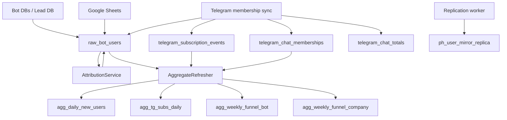
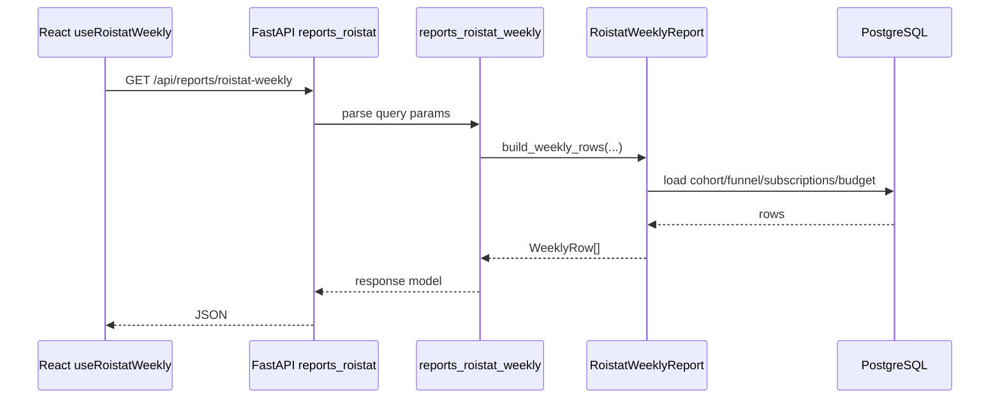

# Data Flow And DB

## Основной принцип

Проект строится вокруг одной центральной аналитической PostgreSQL-БД. Почти все процессы либо:

- пишут в неё сырые данные;
- строят агрегаты поверх сырых данных;
- читают эти таблицы для UI/API.

## Основные таблицы

### Сырые и зеркальные таблицы

| Таблица | Назначение | Кто пишет |
| --- | --- | --- |
| `raw_bot_users` | Главная таблица пути пользователя по ботам/лидам/платформе | `ingestion_service`, `google_sheets_ingestor`, `telegram_ingestor`, attribution/membership reconcile |
| `ph_user_mirror_replica` | Зеркало пользователей PokerHub | `replication_worker` |
| `telegram_subscription_events` | Сырые subscribe/unsubscribe события | telegram membership sync / ingestors |
| `telegram_chat_memberships` | Текущее membership-состояние и joined_at | telegram membership sync |
| `telegram_chat_totals` | Snapshot totals по чатам | telegram membership sync |

### Агрегаты и витрины

| Таблица | Назначение | Кто пишет |
| --- | --- | --- |
| `agg_daily_new_users` | Дневные старты/бюджет/CAC | `AggregateRefresher` |
| `agg_tg_subs_daily` | Дневные bot starts vs telegram subs | `AggregateRefresher` |
| `agg_weekly_funnel_bot` | Недельная воронка по bot_key | `AggregateRefresher` |
| `agg_weekly_funnel_company` | Недельная воронка по advertising_company | `AggregateRefresher` |

### Справочники и служебные

| Таблица | Назначение |
| --- | --- |
| `bot_registry` | Реестр доступных ботов |
| `advertising_companies` | Справочник рекламных компаний |
| `advertising_company_bots` | Привязка bot -> advertising company |
| `budget_weekly` | Плановые weekly budgets |
| `ad_metrics_weekly` | Фактические weekly ad metrics |
| `employee_registry` | Исключаемые TG users / сотрудники |
| `telegram_access` | Доступ пользователей в систему |
| `system_settings` | Настройки scheduler/runtime |
| `sync_event_logs` | Логи sync/job событий |
| `replication_dlq` | Ошибочные replication payloads |

## Поток данных: от источника к отчёту

### 1. Bot DB / Lead DB -> `raw_bot_users`

Источник:

- внешние Postgres-базы ботов;
- lead DB.

Ключевые файлы:

- `backend/app/ingestion/ingestion_service.py`
- `backend/app/services/postgres_registry.py`
- `backend/app/db/postgres_explorer.py`

Логика:

- сервис находит список bot databases;
- определяет схему конкретной БД;
- тянет пользователей батчами;
- дедуплицирует строки по `(bot_key, tg_user_id)`;
- делает upsert в `raw_bot_users`.

Что попадает в `raw_bot_users`:

- bot identity;
- `created_at`;
- username/user_block;
- UTM;
- признаки platform/learning/course/interview/offer/contract;
- ссылки на `ph_user_id`, `lead_user_id`;
- derived поля attribution.

### 2. PokerHub replication -> `ph_user_mirror_replica`

Источник:

- logical replication / stream из внешнего PokerHub.

Ключевые файлы:

- `backend/app/ingestion/replication_worker_manager.py`
- `backend/app/ingestion/replication_stream/*`
- facade: `backend/app/ingestion/replication_worker.py`

Логика:

- replication worker стартует на startup, если включён флаг;
- обрабатывает insert/update/delete события;
- upsert-ит зеркало в `ph_user_mirror_replica`;
- при ошибках складывает payload в `replication_dlq`.

Зачем нужно зеркало:

- course/lesson/group/courses JSON;
- привязка данных PokerHub к аналитике;
- построение lessons/report/cohort срезов без прямых онлайн-запросов наружу.

### 3. Google Sheets -> `raw_bot_users`

Ключевые файлы:

- `backend/app/ingestion/google_sheets_ingestor.py`
- `backend/app/ingestion/google_sheets_ingestor_core.py`
- `backend/app/ingestion/google_sheets_ingestor_impl.py`

Роль:

- обогащает `raw_bot_users` данными из таблиц;
- используется для SM-статусов и части ручных полей/сверок;
- не является единственным источником weekly/report-метрик после рефакторинга.

### 4. Telegram membership -> `telegram_*` + флаги в `raw_bot_users`

Ключевые файлы:

- `backend/app/services/telegram_membership_parts/telegram_membership_sync.py`
- `backend/app/services/telegram_membership_parts/telegram_membership_realtime.py`
- `backend/app/services/telegram_membership_parts/telegram_membership_core.py`

Что происходит:

- система синхронизирует membership чатов/каналов;
- записывает joined/left состояния в `telegram_chat_memberships`;
- пишет события в `telegram_subscription_events`;
- обновляет totals в `telegram_chat_totals`;
- reconcile-ит флаги `channel_subscribed`, `community_member` и related поля в `raw_bot_users`.

## Поток данных внутри БД

## Attribution

Ключевой файл:

- `backend/app/services/attribution_service.py`

Что делает:

- пересчитывает `first_touch_bot`, `first_touch_campaign`;
- пересчитывает `last_touch_bot`, `last_touch_campaign`;
- пишет результат обратно в `raw_bot_users`.

Это критично для:

- touch-отчётов;
- cohort режимов;
- main report в режимах `first_touch` / `last_touch`.

## Aggregate refresh

Ключевые файлы:

- `backend/app/services/aggregate_refresher.py`
- `backend/app/services/aggregate_refresher_rebuild.py`
- `backend/app/services/aggregate_refresher_cache.py`

Пайплайн:

1. определить окно пересчёта;
2. обновить attribution;
3. пересчитать `agg_daily_new_users`;
4. пересчитать `agg_tg_subs_daily`;
5. пересчитать `agg_weekly_funnel_bot`;
6. пересчитать `agg_weekly_funnel_company`;
7. прогреть Redis-кэш.

## Где берутся данные для экранов

| Экран | Основные источники |
| --- | --- |
| `Overview` | `raw_bot_users`, `agg_daily_new_users`, cached summary SQL |
| `BOTs / Funnel` | `raw_bot_users`, `report_repository*`, `report_cache_service` |
| `Main report` | `raw_bot_users`, `budget_weekly`, `ad_metrics_weekly`, `ph_user_mirror_replica`, `telegram_subscription_events` |
| `Weekly` | `raw_bot_users`, `telegram_chat_memberships`, `budget_weekly` |
| `TG SUBS` | `agg_tg_subs_daily`, `telegram_subscription_events`, `telegram_chat_memberships`, `telegram_chat_totals` |
| `PokerHub lessons` | `ph_user_mirror_replica` + attribution via `raw_bot_users` |
| `RAW Users` | `raw_bot_users` |
| `Touch reports` | `raw_bot_users` |

## Weekly: что изменилось

Актуальный Weekly больше не должен описываться как отчёт, который в основном считает метрики из Google Sheets.

Текущая реализация:

- роут: `backend/app/api/routers/reports_roistat.py`
- логика: `backend/app/api/routers/reports_roistat_weekly.py`
- сервис: `backend/app/services/roistat_weekly_parts/*`

Фактические источники:

- `raw_bot_users` — funnel/cohort metrics;
- `telegram_chat_memberships` — channel/saloon subscriptions;
- `budget_weekly` — budget;
- `employee_registry` — исключения внутренних пользователей.

## Под капотом API запроса

Пример: `GET /api/reports/roistat-weekly`

