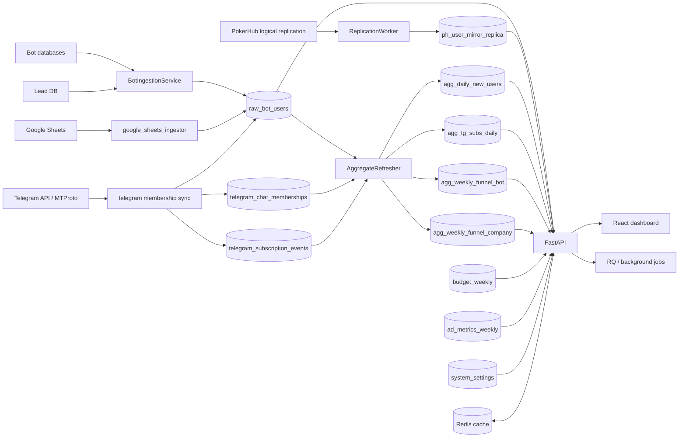

# System Architecture

## Назначение

`analytic-system` — внутренняя система сквозной аналитики для пути пользователя:

`Telegram bot -> lead/almanah -> platform registration -> learning -> course -> interview -> offer -> contract`

Система объединяет несколько источников:

- bot-базы Telegram;
- lead-базу;
- PokerHub mirror / logical replication;
- Google Sheets;
- Telegram membership / subscription данные;
- ручные справочники бюджетов, рекламных компаний, ad metrics.

## High-Level схема

## Runtime компоненты

### 1. FastAPI API

Точка входа:

- `backend/app/main.py`

Что делает на старте:

- подключает CORS и security headers;
- регистрирует общий router;
- запускает `periodic_sync_manager`;
- опционально запускает `replication_worker`;
- планирует realtime membership job;
- прогревает кэш основных отчётов.

### 2. Router layer

Актуальная группировка модулей:

- `backend/app/api/routes.py` — корневой router FastAPI.
- `backend/app/api/routers/__init__.py` — карта логических роутеров.
- `backend/app/api/routers/admin*.py` и `admin_parts/*` — admin, sync, доступ, scheduler, DLQ.
- `backend/app/api/routers/reports*.py` и `reports_*_parts/*` — отчёты, воронка, Roistat, main report.
- `backend/app/api/routers/advertising.py` — рекламные компании и rebuild mappings.
- `backend/app/api/routers/budgets.py` — weekly budgets.
- `backend/app/api/routers/ad_metrics.py` — weekly ad metrics.
- `backend/app/api/routers/auth.py`, `telegram.py` — Telegram auth и membership endpoints.

### 3. Background/runtime слой

- `backend/app/worker/tasks.py` — facade.
- `backend/app/worker/runtime/*` — фактическая реализация фоновых задач, scheduler и shared runtime.
- `backend/app/core/periodic_sync.py` — интервальный запуск ingestion/sync процессов.

### 4. Data services

Основные сервисы:

- `backend/app/ingestion/ingestion_service.py` — bot/lead ingestion в `raw_bot_users`.
- `backend/app/ingestion/replication_worker_manager.py` + `replication_stream/*` — logical replication PokerHub mirror.
- `backend/app/services/attribution_service.py` — обновление `first_touch_*` / `last_touch_*` внутри `raw_bot_users`.
- `backend/app/services/aggregate_refresher*.py` — пересчёт агрегатов и прогрев кэша.
- `backend/app/services/report_cache_service.py` — фасад кэша поверх SQL-репозиториев.
- `backend/app/services/report_repository*.py` — SQL-логика витрин.
- `backend/app/services/roistat_weekly_parts/*` — weekly report и связанные cohort/funnel/metrics срезы.
- `backend/app/services/telegram_membership_parts/*` — MTProto membership sync и reconcile флагов в `raw_bot_users`.

## Паттерн рефакторинга

Во многих местах код уже разбит на срезы, но старые точки импорта сохранены:

- `something.py` часто является facade;
- `something_impl.py`, `something_core.py`, `something_helpers.py`, `something_parts/*` содержат реальную логику.

Это видно, например, в:

- `backend/app/services/roistat_weekly_report.py`;
- `backend/app/ingestion/replication_worker.py`;
- `backend/app/worker/tasks.py`;
- `backend/app/api/routers/reports_roistat_logic.py`.

## Frontend архитектура

### Точка входа

- `frontend/src/main.tsx`
- `frontend/src/App.tsx`

`App.tsx` отвечает за:

- MUI theme;
- dark/light mode;
- Telegram auth flow;
- рендер нового layout `components/layout/OverviewPage.tsx`.

### Главный экран

Основной актуальный layout:

- `frontend/src/components/layout/OverviewPage.tsx`

Там живут:

- глобальные фильтры;
- выбор табов;
- загрузка всех hooks;
- открытие admin/dialog-компонентов;
- orchestration для KPI/таблиц/экспортов.

### Data hooks

Основной паттерн фронта:

- UI-компонент;
- hook `useXxx.ts`;
- вызов соответствующего backend endpoint;
- таблица/карточка рендерит уже подготовленный payload.

Ключевые hooks:

- `useReports.ts`
- `useMainReport.ts`
- `useRoistatWeekly.ts`
- `useRoistatWeeklyTree.ts`
- `useRoistatLessons.ts`
- `useRawUsers.ts`
- `useSubscriptionsCompare.ts`
- `useTouchSummary.ts`
- `useTouchFunnelSummary.ts`
- `useBudgets.ts`
- `useAdMetrics.ts`
- `useSystemSettings.ts`

## Кто за что отвечает

- `backend/app/main.py` — lifecycle приложения.
- `api/routers/*` — HTTP-контракт.
- `services/*` — бизнес-логика и SQL.
- `ingestion/*` — загрузка/репликация/обогащение данных.
- `models/analytics.py` — схема аналитической БД.
- `worker/runtime/*` — фоновые задачи и scheduler.
- `frontend/src/components/*` — UI.
- `frontend/src/hooks/*` — запросы к API и преобразование данных для UI.
- `docs/wiki/*` — операционная документация.
